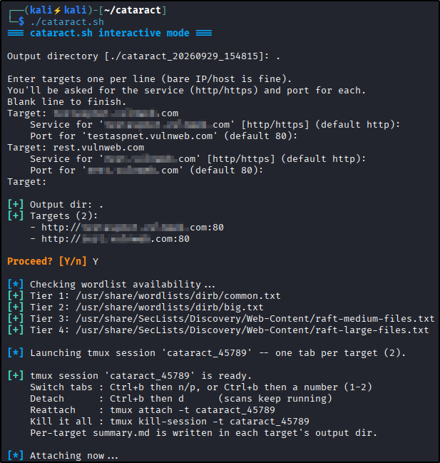
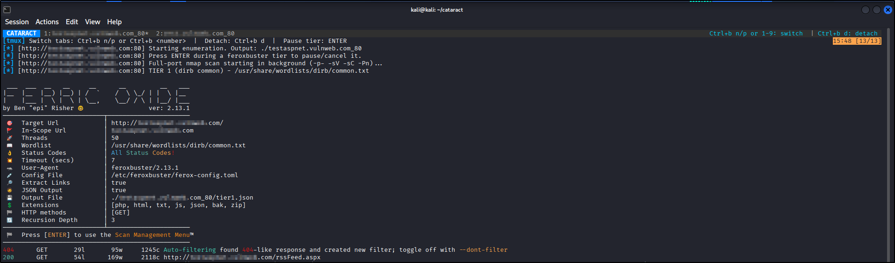

# Cataract

[](https://github.com/YusufAlMahmeed/cataract/actions/workflows/shellcheck.yml)
[](LICENSE)

**Tiered, recursive, multi-target web enumeration for authorized web penetration testing.**

> *A cataract is a great waterfall — and that's the idea: your scan cascades down through escalating wordlist tiers until you find what you need.*

`cataract.sh` automates the tedious part of early web recon: deciding *which wordlist, when*. It runs a full-port `nmap` scan in the background while `feroxbuster` works through escalating wordlist "tiers" in the foreground, prompting you between tiers so you only pay for `raft-large` when you actually need it. Point it at several targets and it opens **one tmux window with a tab per target**, so you can watch and switch between them without a mess of pop-up windows.

> ⚠️ **Authorized testing only.** Use this exclusively against systems you own or have explicit written permission to test (your own VMs, lab environments, and authorized client engagements). Unauthorized scanning is illegal in most jurisdictions. You are responsible for how you use it.

---

## Screenshots

| Interactive run — pick service &amp; port per target | Live scan across tmux tabs |
| :--: | :--: |
|  |  |

---

## Features

- **Flexible targets** — bare IP, `host:port`, or full URL. Bare values are normalized to `http://` automatically.
- **Per-target service & port selection** — in interactive mode you pick `http`/`https` and the port for each target, so `feroxbuster` hits exactly the URL you intend.
- **Parallel port scan** — a full 65535-port `nmap -p- -sV -sC -Pn` scan runs in the background while the web brute-force proceeds; results are waited on and reported at the end.
- **Escalating tier cascade** with a *continue?* prompt after each tier:
  | Tier | Wordlist | Source |
  | ---- | -------- | ------ |
  | 1 | `dirb/common.txt` | `dirb` (required) |
  | 2 | `dirb/big.txt` | `dirb` (required) |
  | 3 | `raft-medium-directories.txt` (+ `raft-medium-files.txt`, no-ext pass) | SecLists (optional) |
  | 4 | `raft-large-directories.txt` (+ `raft-large-files.txt`, no-ext pass) | SecLists (optional) |
- **Auto-enumerates extra web ports** — parses the `nmap` results, finds additional `http`/`https` services (8080, 8443, …), and offers to run the cascade against those too (automatic in `--auto`).
- **Recursive** directory/file discovery (`feroxbuster`, depth 2 by default) — something `gobuster` doesn't do natively.
- **Self-signed TLS handled** — `feroxbuster -k` is auto-enabled for `https://` targets (and forceable with `-k`), so lab/internal certs don't silently kill your results.
- **Colorized live output *and* logs *and* JSON** — each tier runs under a pseudo-terminal (via util-linux `script`) so `feroxbuster` keeps its colors on screen while everything is `tee`'d to a log **and** written as JSON for robust `jq`-based de-duplication (falls back to log parsing if `jq` is absent).
- **Reports** — a per-target `summary.md` (open ports + notable hits) and a combined `index.md` across targets.
- **Scriptable** — CLI flags for threads, depth, extensions, a custom wordlist, rate limiting, extra headers (auth cookies), and a fully non-interactive `--auto` mode.
- **One window, one tab per target** via tmux — reliable across setups, works over SSH, and survives disconnects (detach/reattach). Settings you pass propagate into every tab.
- **Upfront preflight checks** — verifies required tools and wordlists and prints exact `apt install` hints before doing anything.
- **Graceful degradation & clean shutdown** — no tmux? Falls back to sequential. Ctrl+C never orphans a background `nmap`.
- **Easy tunables** — threads, recursion depth, extensions, and tier wordlists are grouped at the top of the script (all overridable by flags).

---

## Prerequisites

> **Linux only (Kali/Debian/Ubuntu tested).** Cataract uses util-linux `script -qec` to keep feroxbuster colorized while logging, which is not available on macOS/BSD; it exits early with a clear message on non-Linux hosts.

| Tool | Required? | Purpose |
| ---- | --------- | ------- |
| `bash` | yes | interpreter |
| `nmap` | yes | full-port service/script scan |
| `feroxbuster` | yes | recursive content discovery |
| `script` (util-linux) | yes | preserves colorized output while logging |
| `tmux` | recommended | one window with a tab per target (falls back to sequential if absent) |
| `rustscan` | optional | *faster* phase-1 port discovery on low-latency targets (nmap is the accurate default engine) |
| `jq` | recommended | JSON-based de-duplication of results (falls back to log parsing if absent) |
| `dirb` wordlists | yes | Tiers 1–2 (`common.txt`, `big.txt`) |
| `seclists` | optional | Tiers 3–4 (`raft-*-directories.txt` + `raft-*-files.txt`) |

### One-line install (Debian/Kali/Ubuntu)

```bash
sudo apt update && sudo apt install -y nmap feroxbuster tmux jq dirb seclists bsdutils util-linux
```

> On **Kali** you can add `rustscan` to that line too. On Debian/Ubuntu it isn't packaged — see [Installing RustScan](#installing-rustscan-optional-recommended) below (it's optional either way).

> SecLists installs under different paths/casings across distros (`/usr/share/seclists`, `/usr/share/SecLists`, `/opt/SecLists`, …). The script searches all the common locations automatically, so Tiers 3–4 usually "just work" once `seclists` is installed.

### Installing RustScan (optional, recommended)

RustScan makes phase-1 port discovery dramatically faster on low-latency targets. It's **optional and off by default** — Cataract uses nmap for accuracy unless you opt in with `FAST_SCANNER=rustscan` (or `FAST_SCANNER=auto`). On slow/remote hosts RustScan can miss ports, so prefer it for lab/internal networks.

**On Kali it's in the repos** — just:

```bash
sudo apt install rustscan
```

**On Debian/Ubuntu** (not packaged there) use a prebuilt `.deb` from the [RustScan releases page](https://github.com/RustScan/RustScan/releases), or Cargo:

```bash
cargo install rustscan     # installs to ~/.cargo/bin — make sure that's on your PATH
```

Verify it's visible to Cataract (then it's auto-used):

```bash
rustscan --version
```

Then enable it per run with `FAST_SCANNER=rustscan ./cataract.sh …` (or `FAST_SCANNER=auto`). Tune it with `RUSTSCAN_OPTS` (default `--ulimit 5000`; add a smaller `-b` / larger `-t` if it under-reports on a slower target).

### Get it

```bash
git clone https://github.com/YusufAlMahmeed/cataract.git
cd cataract
chmod +x cataract.sh
```

---

## Usage

### Interactive (no arguments)

```bash
./cataract.sh
```

Prompts for an output directory, then targets (one per line, blank line to finish). **For each bare target it asks which service (`http`/`https`) and which port to use**, then shows a summary and asks you to confirm before running:

```
Target: 10.10.10.5
    Service for '10.10.10.5' [http/https] (default http): https
    Port for '10.10.10.5' (default 443): 8443
```

(Type a full URL like `https://10.10.10.5:8443` and it's used verbatim, no prompts.)

### Non-interactive / scripting

```bash
# One or more targets on the command line
./cataract.sh -o results/ 192.168.51.77 10.10.10.5:8080 https://app.local

# Targets from a file (one per line; blank lines and #comments ignored)
./cataract.sh -o results/ -f targets.txt

# Fully unattended, tuned, behind a login, gentle on the target
./cataract.sh -o results/ -a -t 30 -d 2 --rate-limit 40 \
              -H 'Cookie: session=abc123' https://app.local:8443

# Preview the plan + request estimates without scanning anything
./cataract.sh -o results/ -w quick.txt -w big.txt --dry-run https://app.local
```

| Flag | Meaning |
| ---- | ------- |
| `-o <dir>` | output directory (required in non-interactive mode) |
| `-f <file>` | read targets from a file, one per line |
| `-t <n>` | feroxbuster threads (default 50) |
| `-d <n>` | recursion depth (default 2) |
| `-x <exts>` | comma-separated extensions |
| `-w <wordlist>` | custom wordlist instead of the tier cascade; **repeatable** — runs in the order given (paths checked up front) |
| `--no-ext` | don't append extensions on any pass (filenames-only) |
| `--udp` | also scan the top 100 UDP ports (`nmap -sU`) in the background; needs root, off by default |
| `--dry-run` | print targets, wordlists, settings and request estimates, then exit without scanning |
| `-k`, `--insecure` | disable TLS validation (auto-enabled for `https://`) |
| `-a`, `--auto` | non-interactive: run all tiers, auto-enumerate discovered ports |
| `-H <header>` | extra HTTP header (repeatable), e.g. `-H 'Cookie: …'` |
| `--rate-limit <n>` | cap feroxbuster at n requests/sec |
| `<target> …` | one or more targets as positional arguments |
| `-h`, `--help` | usage |

A **single target** just runs in your current terminal — no tmux involved.

---

## The tier system

Web content brute-forcing is a trade-off between coverage and time. Rather than committing to a huge wordlist up front, Cataract escalates:

1. **Tier 1 — `dirb/common.txt`** — fast, catches the obvious stuff.
2. **Tier 2 — `dirb/big.txt`** — broader, still quick.
3. **Tier 3 — SecLists `raft-medium-directories.txt`** — real coverage.
4. **Tier 4 — SecLists `raft-large-directories.txt`** — exhaustive; slow.

Tiers 3–4 use the **directories** lists (not the files lists) for two reasons: directory words carry no extension, so appending your extension set is correct instead of producing waste like `index.php.php`, and directories are what feroxbuster's recursion descends into. When the matching `raft-*-files.txt` list is present, Cataract runs it as an extra **filename pass without `--extensions`**, so real filenames are still covered.

After each tier you're asked whether to continue. Stop as soon as you've found what you need — you rarely have to reach Tier 4. All tiers use recursion (depth 2 by default) and the same extension set by default. In `--auto` mode the prompts are skipped and every tier runs unattended.

**Skip the tiers entirely** with your own wordlists. `-w` is repeatable and the lists run **in the order you give them**; every path is checked to exist before any scanning starts:

```bash
# one custom list
./cataract.sh -o results/ -w /path/to/mylist.txt https://app.local

# several, in order (quick → thorough), filenames-only
./cataract.sh -o results/ -w quick.txt -w big.txt -w ~/custom/api.txt --no-ext https://app.local
```

Interactive mode asks for these paths too (one per line, blank to finish).

### Tunables (top of the script)

```bash
: "${THREADS:=50}"                                # feroxbuster concurrent threads
: "${DEPTH:=2}"                                    # recursion depth (raise with -d)
: "${EXTENSIONS:=php,html,txt,js,json,bak,zip}"    # extensions appended to each word
: "${NMAP_OPTS:=-p- -sV -sC -Pn}"                  # full-port service/script scan
```

Each tunable can be overridden by a CLI flag (`-t`, `-d`, `-x`, …). The `TIER*_CANDIDATES` arrays just below let you add or reorder wordlist paths.

> **Two-phase scan.** Each host is scanned in two steps, **before** web enumeration: a **fast all-ports sweep** finds every open port, then a **deep service/script scan** (`NMAP_DEEP_OPTS`, default `-sV -sC -Pn`) runs on just those ports. This is much quicker than `-sV -sC` across all 65535 ports, and it means Cataract knows which ports actually serve http/https — even on non-standard ports — and enumerates those, instead of only the port you guessed. Both phases are saved (`_fast.txt` / `_deep.txt`).
>
> **Engine (`FAST_SCANNER`), accuracy-first default.** Phase 1 defaults to **nmap** (`FAST_SCANNER=nmap`, opts `NMAP_FAST_OPTS`, default `-p- -T4 --min-rate 1000 -Pn -n`) because nmap's `-p-` sweep reliably finds every open port on **any** target. **[RustScan](https://github.com/RustScan/RustScan)** (`FAST_SCANNER=rustscan`, or `auto` = rustscan-if-installed) is *much* faster, but as an aggressive async scanner it can **miss ports on high-latency or rate-limited links** (RustScan itself warns about this) — so use it on **low-latency lab/internal networks**, where it's both fast and accurate. Whichever finds the ports, **phase 2 always re-scans them with `nmap -sV -sC`**, so service/version detection is nmap-accurate. Tune RustScan via `RUSTSCAN_OPTS` (default `--ulimit 5000`; on a slow target RustScan suggests a smaller `-b` batch and a larger `-t` timeout). Raising nmap's `--min-rate` speeds nmap but can miss ports on lossy links, so only push it on reliable networks.
>
> Scan output is streamed **live** to the screen (and logged); nmap uses `--stats-every` (default `15s`, set `NMAP_STATS_INTERVAL`) so a long sweep visibly reports `% done` and ETC rather than sitting silently.
>
> **Root:** run as **root** for a fast SYN sweep. Without root, nmap uses a slower TCP connect scan (`-sT`) and Cataract warns you at startup.

---

## Multiple targets: tmux tabs, pausing, and stopping

When you give more than one target, Cataract opens **one tmux session with one tab (window) per target** — a single window you can switch between, not a swarm of pop-ups. All tab-bar styling is applied to *this session only*; your `~/.tmux.conf` is never modified.

The tab bar shows a clear `CATARACT` label on the left, highlights the **active tab**, and prints navigation hints on the right.

| Action | Keys |
| ------ | ---- |
| Next / previous tab | `Ctrl+b` then `n` / `p` |
| Jump to a specific tab | `Ctrl+b` then `1`–`9` |
| Click a tab | mouse is enabled |
| **Pause / cancel the current tier** | press **ENTER** → opens feroxbuster's *Scan Management Menu* |
| Detach (leave everything running) | `Ctrl+b` then `d` |
| Reattach later | `tmux attach -t <session>` (the name is printed at launch, e.g. `cataract_12345`) |
| Kill the current tab | `Ctrl+b` then `&` |
| **Stop the whole run** | `tmux kill-session -t <session>` (from any shell) |

> `Ctrl+b` is tmux's default prefix key. Press and release it, *then* press the next key.

> **Stopping always saves your results.** However you stop — `Ctrl+C`, closing the terminal, or `tmux kill-session` — Cataract de-duplicates whatever each in-progress target has found so far and writes its `results.txt`, `all_unique_results.txt`, `summary.md` and the combined `index.md` before exiting. Partial JSON from a cut-short scan is parsed tolerantly, so nothing already discovered is lost.

### GUI-terminal opt-in (not recommended)

tmux is the default because native GUI-terminal tabs proved unreliable across environments (Terminator doesn't support gnome-terminal's `--tab -e` chaining; `gnome-terminal`/`xfce4-terminal --tab` open separate windows when the terminal is already running). If you specifically want separate desktop windows anyway:

```bash
USE_GUI_TERM=1 ./cataract.sh -o results/ target1 target2
```

This opens **one window per target** (not tabs) using whichever emulator is installed, and falls back to sequential execution if none is found.

---

## Output layout

```
<output_dir>/
├── index.md                       # links to every target's summary
├── _nmap/                         # two-phase nmap per unique host (shared)
│   ├── 10.10.10.5_fast.txt        # phase 1: fast all-ports sweep
│   ├── 10.10.10.5_fast.log
│   ├── 10.10.10.5_deep.txt        # phase 2: -sV -sC on the open ports
│   ├── 10.10.10.5_deep.log
│   └── 10.10.10.5_udp.txt         # only with --udp: top-100 UDP scan
└── <target-safe-name>/            # e.g. 192.168.51.77_8443
    ├── common.log  common.json    # result files are named after the wordlist
    ├── big.log  big.json
    ├── raft-medium-directories.log  raft-medium-directories.json
    ├── results.txt                # de-duplicated hits for this service
    ├── port_8080/                 # extra web port nmap found (its own cascade)
    │   ├── common.log  common.json
    │   └── results.txt
    ├── all_unique_results.txt     # combined, de-duplicated hits across all ports
    └── summary.md                 # open ports + notable findings, ready to paste into notes
```

Results are de-duplicated from the JSON when `jq` is available (robust); otherwise Cataract falls back to parsing the ANSI-stripped logs.

---

## Troubleshooting

- **"Missing required tools"** — install the listed packages (see the one-liner above).
- **Tiers 3–4 say "not found"** — install SecLists: `sudo apt install seclists`.
- **No tmux** — the script warns and runs targets sequentially. Install tmux for tabs.
- **HTTPS target returns nothing** — likely a self-signed cert. Cataract auto-adds `-k` for `https://` targets; if you passed the target as a bare host, choose `https` at the service prompt (or use `-k`).
- **`results.txt` looks empty but the log has hits** — install `jq` (`sudo apt install jq`) for reliable JSON parsing; without it, parsing falls back to the logs.
- **Colors look garbled in a log file** — that's the raw ANSI in the per-tier `.log`; use `results.txt` / `all_unique_results.txt` for clean parsing, or `less -R somefile.log` to view colors.

---

## Changelog

See [CHANGELOG.md](CHANGELOG.md) for release history.

## License

Released under the [MIT License](LICENSE). Provided as-is, for authorized security testing and education.
